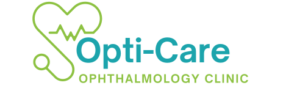
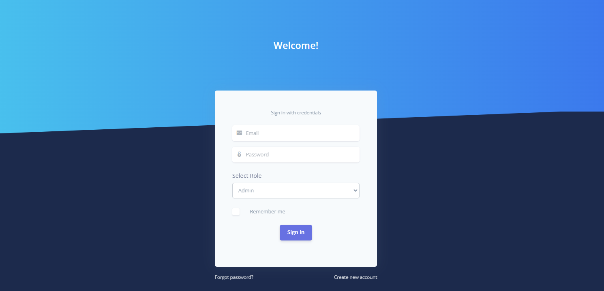
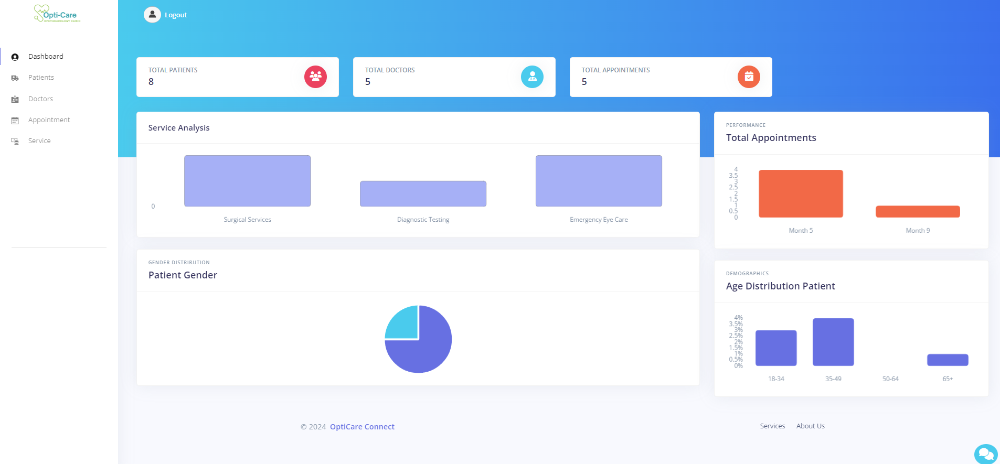
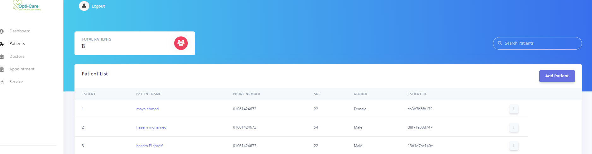
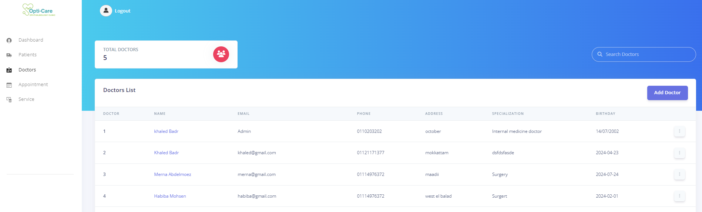
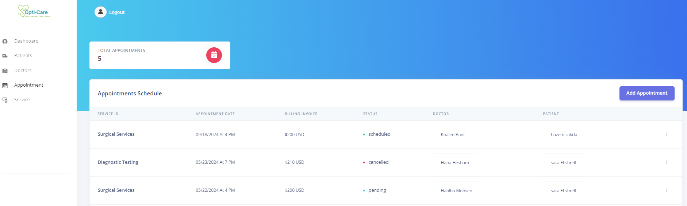
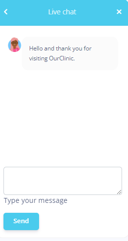

# Ophthalmology Clinic Information System (OCIS)

## Overview
The Ophthalmology Clinic Information System (OCIS) is a specialized software solution tailored to enhance operational efficiency in ophthalmology clinics. The system manages patient records, appointments, billing, and inventory efficiently and securely using the MERN stack (MongoDB, Express.js, React, and Node.js). This powerful technology stack ensures a robust, scalable, and interactive application that meets the complex needs of modern healthcare facilities.

## Features

- **User Authentication**: Secure login for administrators, patients, and doctors.
- **Dashboard Management**: Custom dashboards for admins, doctors, and patients with respective functionalities.
- **Patient Management**: Comprehensive management of patient records, appointments, and billing.
- **Doctor Management**: Doctor profiles, schedule management, and access to patient records.
- **Appointment Scheduling**: Efficient handling of appointments including scheduling, rescheduling, and cancellation.
- **Real-time Updates**: Instant updates on appointments, patient records, and more.
- **Security**: High-end security with JWT and bcrypt for hashing to protect sensitive medical and personal data.
- **Chatbot**: Interactive chatbot for real-time assistance and support to users navigating through the system, powered by ChatGPT with Flask and Python.

## Technology Stack

- **Frontend**: React.js
- **Backend**: Node.js with Express.js
- **Database**: MongoDB
- **Chatbot Backend**: Flask and Python
- **Authentication**: JWT, bcrypt

## Installation

To set up the project locally, follow these steps:

1. Clone the repository:
git clone https://github.com/Habiba-Mohsen/Opticare-connect
### Install Backend Dependencies
Navigate to the backend directory and install the necessary dependencies.
cd backend
npm install
### Run the Backend
Start the backend server.
npm start
### Install Frontend Dependencies
Navigate to the frontend directory and install the necessary dependencies.

cd frontend
npm start

### Install and Run Chatbot

Navigate to the chatbot directory within the backend folder and set up the Python environment.

cd backend/chatbot
pip install -r requirements.txt

Run the chatbot.
python chatbot.py

## Usage

To access the system, navigate to `localhost:3000` in your web browser. Use the login credentials provided by your system administrator to access the different functionalities based on your role (Admin, Doctor, Patient).

## Screenshots

### Login Page

### Admin Dashboard

### Patient Management

### Doctor Management

### Appointment Scheduling

### Live Chat Feature

## Contributing
Gratitude goes out to all team members for their valuable contributions to this project.

  
    
    
   
    
      
      </a>
      

## License

This project is licensed under the [MIT License](LICENSE.md).

